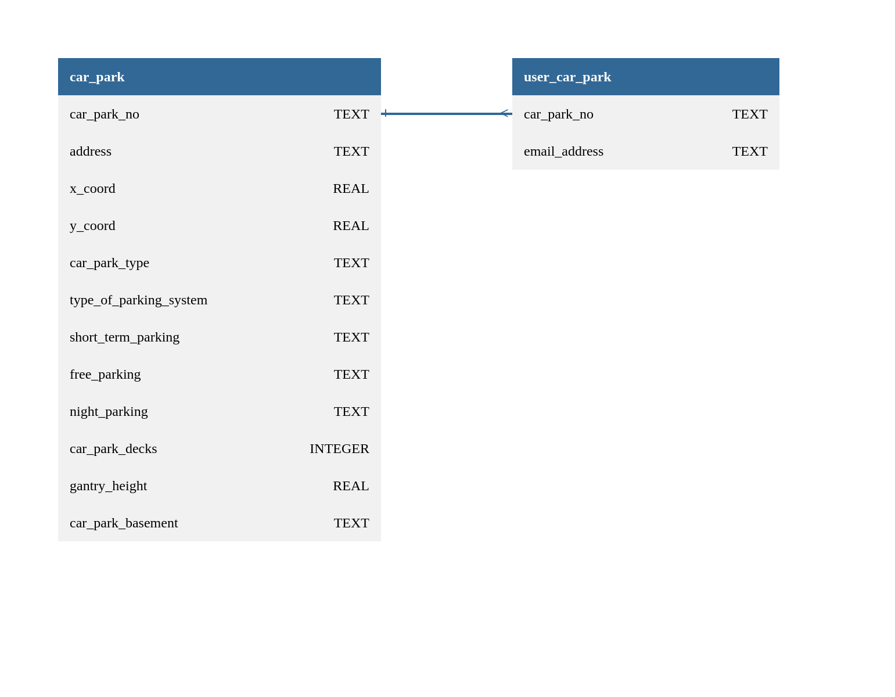

# Overview

The original README for this assignment is documented in `PROBLEM.md`

Here, a quick overview of the project will be documented

This project is a nodejs project using express for routing and sqlite as an in-memory database

Please refer the `/src` folder for the source filters

To run the project, run `npm start`

To visit the swagger UI, visit `http://localhost:3000/api-docs` in the browser.
There relevant API documentation can be found

A simple ER diagram can be found here:

